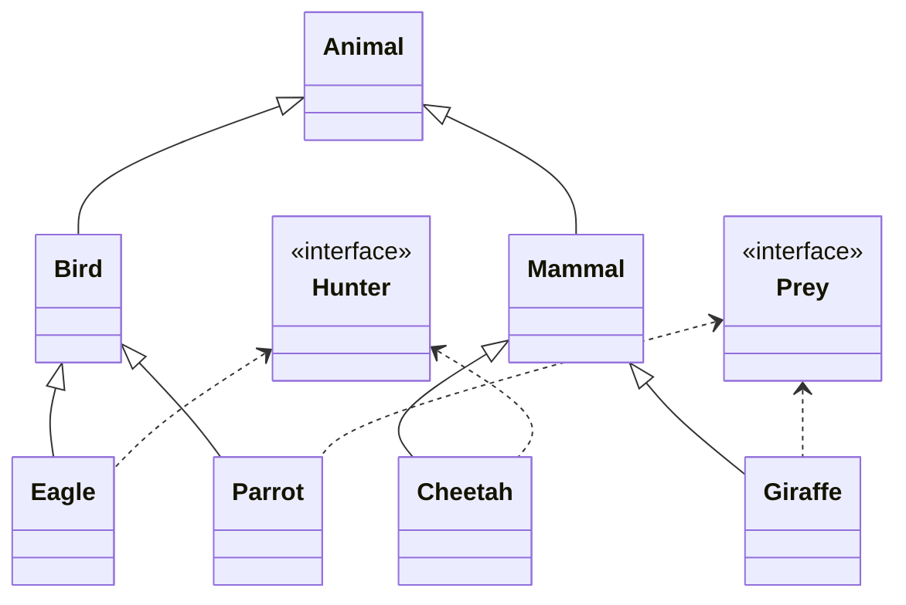

# Animal Hierarchy Project

## Overview
This project implements a class hierarchy system for different types of animals, including their behaviors and characteristics. The system includes classes for various animals with inheritance relationships and behavioral interfaces.

## Class Hierarchy
The project follows this class hierarchy structure:



### Design Documentation
The complete class diagram can be found in the `docs/design` directory:

```
docs/
└── design/
    └── class-hierarchy.drawio
```

## Class Descriptions

### Base Classes
- `Main`: The entry point of the application
- `Animal`: The base class for all animal types
- `Bird`: Base class for flying animals
- `Mammal`: Base class for mammals

### Interfaces
- `Hunter`: Defines behavior for animals that hunt
- `Prey`: Defines behavior for animals that can be hunted

### Concrete Classes
- `Eagle`: A bird that implements hunter behavior
- `Parrot`: A bird that implements prey behavior
- `Cheetah`: A mammal that implements hunter behavior
- `Giraffe`: A mammal that implements prey behavior

## Project Structure
```
src/
├── Main.java
├── animal/
│   ├── Animal.java
│   ├── Bird.java
│   └── Mammal.java
├── animalNature/
│   ├── Hunter.java
│   └── Prey.java
└── animalEntity/
    ├── Eagle.java
    ├── Parrot.java
    ├── Cheetah.java
    └── Giraffe.java
```

## Built With
- Java
- [Draw.io](https://draw.io) - For UML diagrams

## Getting Started
1. Clone the repository
2. Open the project in your preferred Java IDE
3. Run `Main.java` to start the application
